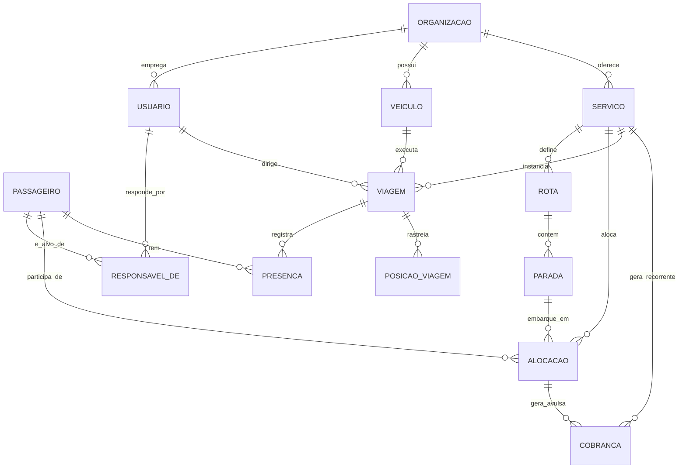

# Especificação Técnica — App de Gestão de Vans Escolares (Litoral Sul SP)

> Este documento consolida as decisões de produto e arquitetura já validadas. Serve como fonte de verdade para qualquer sessão de desenvolvimento (humana ou com Claude Code) — deve ser lido antes de qualquer mudança estrutural no schema ou na arquitetura.

## 1. Contexto e problema

SaaS de gestão e rastreamento para vans escolares, com MVP focado no transporte escolar/universitário diário no Litoral Sul de SP (Itanhaém, Mongaguá, Peruíbe, Praia Grande). A arquitetura precisa suportar, desde o dia zero, a expansão futura para excursões, caravanas e fretamentos avulsos, sem retrabalho de schema.

**Problemas centrais resolvidos:**
- Pais: ansiedade por não saber onde está a van, comunicação de faltas, aviso de proximidade.
- Motoristas: reorganização de rota quando há faltas, controle financeiro, lista de chamada digital.
- Ambos: match de rota entre passageiro e motorista sem grandes desvios.

## 2. Escopo do MVP (V1.0)

### App dos Pais/Responsáveis
- Rastreamento em tempo real da van no mapa (posição do veículo)
- Notificação de proximidade
- Avisar falta do aluno com prazo de corte
- Confirmação de embarque/desembarque
- Mural de avisos + botão de emergência

### App do Motorista
- Lista de chamada digital (check-in/check-out por parada, offline-first)
- Rota do dia com reordenação simples (remover parada + recalcular ETA, sem VRP)
- Painel financeiro simples (pago / inadimplente / a receber no mês)
- Início/fim de rota, "cheguei", emergência

### Backend/core
- Cadastro de Passageiro, Responsável, Rota, Van, Motorista
- Motor de geolocalização + cálculo de ETA
- Cobrança recorrente via Pix Automático / boleto (gateway Asaas)
- Fila de sincronização offline

## 3. Explicitamente fora do MVP (arquitetura deve prever)

- Match/otimização automática de rota via VRP — no MVP é semi-manual com clustering geográfico simples
- Excursões e fretamentos avulsos (cobrança por evento, embarque variável)
- Marketplace de vans/motoristas com vagas ociosas
- Split de pagamento entre múltiplas escolas na mesma van
- Portal institucional para escolas
- Telemetria veicular avançada (frenagem, velocidade)

## 4. Modelo de domínio

Princípio central: **não modelar em torno de "Aluno"/"Escola"**. O domínio generaliza para Passageiro/Serviço/Evento, permitindo que rotina escolar e fretamento pontual coexistam no mesmo schema.

### 4.1 Entidades e relacionamentos



### 4.2 Glossário (linguagem ubíqua — usar estes nomes em português no código e no banco)

| Termo | Significado |
|---|---|
| `Organizacao` | Tenant. Cada motorista/frota opera como uma organização isolada. |
| `Usuario` | Login único; pode acumular papéis (`motorista`, `responsavel`, `operador`). |
| `Passageiro` | Substitui "Aluno". Quem é transportado. |
| `Responsavel` | Relação `ResponsavelDe` entre um `Usuario` e um `Passageiro` — não embutida no passageiro, permite adulto contratando para si mesmo. |
| `Servico` | Entidade central. `tipo`: `RECORRENTE` (rotina escolar) ou `PONTUAL` (excursão/fretamento). |
| `Rota` | Sequência ordenada de `Parada`s, pertence a um `Servico`. |
| `Alocacao` | Vincula `Passageiro` a `Servico` numa `Parada` específica. |
| `Viagem` | Instância concreta de um `Servico` num dia/horário — onde vivem GPS e presença. |
| `Presenca` | Check-in/check-out por `Passageiro` por `Viagem`. |
| `Cobranca` | `RECORRENTE` (ligada ao `Servico`) ou `AVULSA` (ligada a `Alocacao`). |

## 5. Máquinas de estado

### Viagem
`Planejada → Em andamento → Finalizada`
`Planejada → Cancelada` e `Em andamento → Cancelada` são válidos. `Finalizada` é terminal — nunca cancela a partir daí. Validar com `CHECK constraint` ou trigger, não só na aplicação.

### Cobranca
`Pendente → Paga` (pagamento direto)
`Pendente → Inadimplente` (vence sem pagamento)
`Inadimplente → Paga` (regularização)

## 6. Arquitetura

### 6.1 Visão geral
Dois apps cliente (motorista, responsável), um backend único multi-tenant. Não construir um terceiro app mobile para o papel `operador` — resolver com painel web simples no MVP.

### 6.2 Sincronização offline (o ponto de maior risco técnico)
- App motorista grava toda ação localmente primeiro (nunca bloqueia esperando rede).
- Toda ação vira um evento na fila local (outbox), com `status` (pendente/enviado/confirmado) e `retry_count`.
- Evento só sai da fila quando o backend confirma recebimento.
- Backend precisa de idempotência: cada evento carrega um id gerado no cliente; reprocessar o mesmo id não deve duplicar efeito (ver tabela `eventos_sync` no schema).

## 7. Stack tecnológica

| Camada | Escolha | Justificativa |
|---|---|---|
| Apps | React Native + Expo | Compartilha TypeScript com o backend; dois apps, um monorepo |
| Sync offline | WatermelonDB | Padrão outbox pronto, ativo e maduro, encaixe direto com RN |
| Backend | NestJS (TypeScript) | Modular, multi-tenancy natural, Gateway WebSocket nativo |
| Banco | PostgreSQL + PostGIS | Único caminho maduro para cálculos geoespaciais |
| ORM | Drizzle | SQL-first — essencial para escrever `ST_Distance`/`ST_DWithin` sem perder tipagem |
| Tempo real | WebSockets (Socket.io) | Suficiente para a escala do MVP; evita operar broker MQTT sem necessidade |
| Pagamento | Asaas (Pix Automático + boleto) | Não reimplementar cobrança recorrente contra o Banco Central |
| Monorepo | Turborepo | Leve o suficiente para um time pequeno |
| Mapa (a confirmar) | Mapbox ou Google Maps | Mapbox mais barato em escala; decidir antes de iniciar as telas de mapa |
| Push (a confirmar) | Expo Notifications | Já incluso no Expo, suficiente para o MVP |
| Hosting (a confirmar) | Railway/Render + Neon | Menos operação que AWS direto; migrar depois se necessário |

## 8. Estrutura do monorepo

```
/apps
  /motorista        (React Native/Expo)
  /responsavel       (React Native/Expo)
  /api               (NestJS)
/packages
  /domain-types      (tipos compartilhados)
  /api-client        (client tipado consumindo a API)
  /ui                (design system compartilhado)
/db
  schema.ts          (Drizzle — ver db/schema.ts)
```

## 9. Roadmap de construção (fases com critério de pronto)

1. **Setup** — monorepo, CI/CD, lint/format, envs → pronto quando `turbo build` roda limpo em todos os pacotes
2. **Schema + migrations** — tabelas, índices, seeds → pronto quando migrations rodam do zero e seeds populam dados de teste
3. **Backend core** — auth multi-papel, CRUD base, isolamento de tenant → pronto quando um usuário de uma organização não consegue ler dados de outra (testado)
4. **Domínio** — Servico/Rota/Alocação/Viagem + regras de estado → pronto quando as transições inválidas são rejeitadas por teste
5. **Geolocalização + tempo real** — ETA, WebSocket, proximidade → pronto quando a posição de uma van em uma `Viagem` chega em tempo real a um cliente conectado
6. **Sync offline** — client WatermelonDB + endpoints de sync + idempotência → pronto quando uma sequência de ações feitas offline sincroniza sem duplicar nem perder eventos
7. **Cobrança** — integração Asaas, webhooks, painel financeiro → pronto quando um pagamento real (sandbox) muda o status da cobrança via webhook
8. **UI dos dois apps** — todas as telas do escopo do MVP → pronto quando cada fluxo do escopo (seção 2) é executável fim a fim
9. **Testes/deploy** — QA, ajustes, publicação nas lojas → pronto quando o app está nas lojas em modo de teste (TestFlight/internal track)

## 10. Decisões em aberto antes de começar a codar

- [ ] SDK de mapa: Mapbox vs Google Maps
- [ ] Hosting definitivo do backend e do banco
- [ ] Detalhes de autenticação (rotação de refresh token, MFA para operador?)
- [ ] Política de retenção de `posicoes_viagem` (GPS histórico) — vai crescer rápido, definir TTL/particionamento
